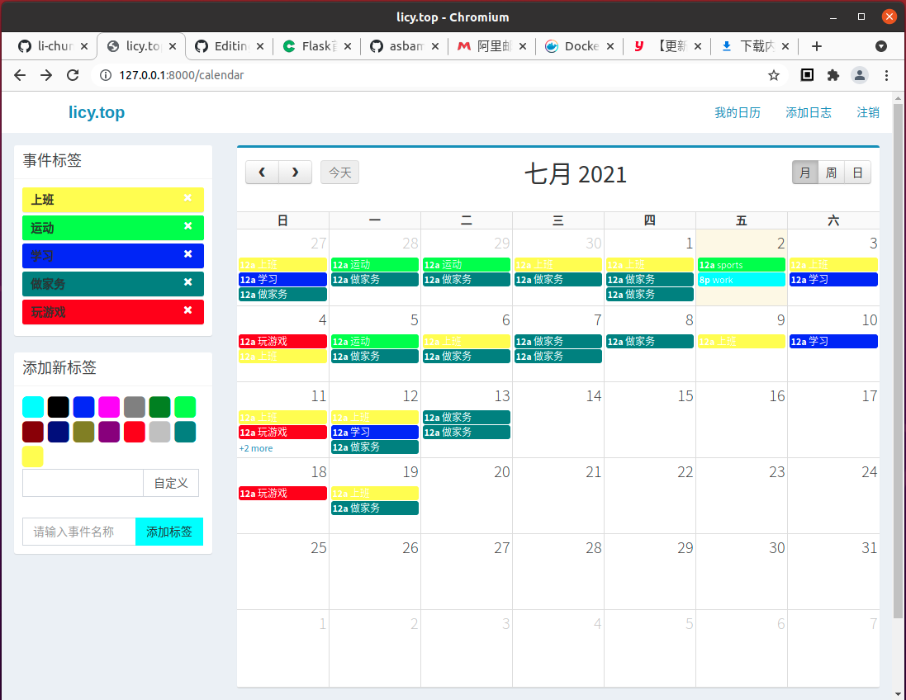

日历记事系统[timelog]
==============================

这是一个日历记事系统，它是使用python的Flask框架、mongodb、html5、javascript（jquery、bootstrap等）、css构建的H5应用。

demo
===============================

http://timelog-demo.licy.top

体验一下
===============================

* 拉取git代码
    git clone https://github.com/li-chun-yin/timelog.git
* 进到代码的根目录
    cd timelog
* 修改目录下的配置文件
    vi config.py

    文件内容如下，如果后面尝试使用docker运行的话不要修改MongoDB的配置（docker里面会安装db）。

    ::

        # -*- coding: utf-8 -*-

        DEBUG                   = True
        SECRET_KEY              = 'timelog_key'

        MONGODB_DNS             = 'mongodb://localhost:27017/'
        MONGODB_DATABASE        = 'timelog'

        SYSTEM_EMAIL_HOST       = '*******'
        SYSTEM_EMAIL_ACCOUNT    = '*******'
        SYSTEM_EMAIL_PASSWORD   = '*******'

* 可以在python环境配置好的状况下，直接运行app.py
    ./app.py

  或者我在项目中提供了 `docker`_ 镜像构建方法
    
    #. 创建docker image
        docker build -t timelog:latest ./

    #. 创建并运行docker container (端口映射可以改，比如-p127.0.0.1:8000:80)

        sudo docker run -d -p80:80 --name timelog timelog:latest

    #. 现在在浏览器中url访问80端口应该就可以运行了
        http://timelog-demo.licy.top

.. _docker: https://docs.docker.com/
